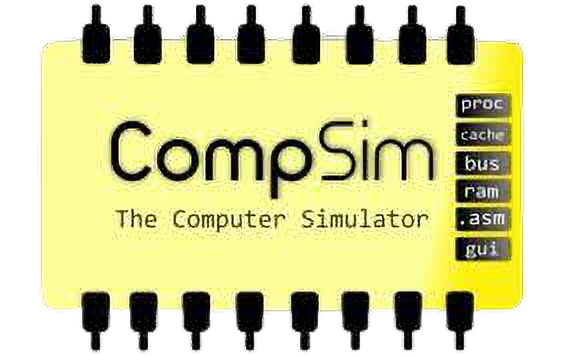
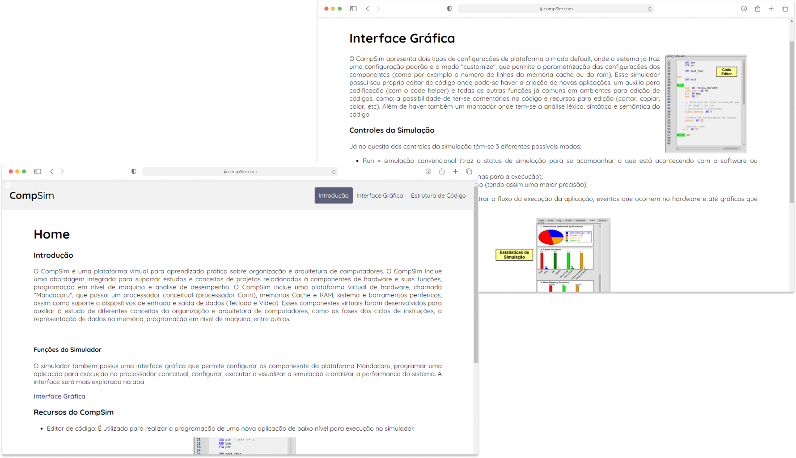
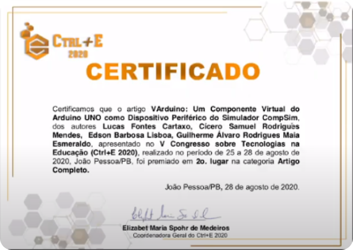

<h1 align="center">
  
</h1>

 CompSim - O Simulador de Computadores é um ambiente virtual de aprendizagem   prática em Organização e Arquitetura de Computadores. 

  

 

  

 

## 👨‍💻 Desenvolvimento

**CompSim - O Simulador de Computador** está sendo desenvolvido como um projeto de cooperação técnico-científica entre os Institutos Federais do Ceará (Crato) e Sergipe (Aracaju), sob a coordenação dos Professores Guilherme Esmeraldo e Edson Lisboa.

 

## 📩 Download

**CompSim - O Simulador de Computador** está atualmente disponível sob licença freeware. Porém, no futuro, é objetivo do grupo de pesquisa disponibilizá-lo sob alguma licença gratuita quando seu código-fonte atingir a maturidade e o simulador ficar mais estável.

 

| 💻 OS     | 🏗 Arquitetura | Versão | 📩 Download                                                                 |
| :-------- | :------------ | :----- | :-------------------------------------------------------------------------- |
| Windows   | 32-bits       | 0.8.7a | [ ZIP](http://compsim.crato.ifce.edu.br/releases/CompSim_v0.8.7a-Win32.zip) |
| Windows   | 64-bits       | 0.8.7a | [ ZIP](http://compsim.crato.ifce.edu.br/releases/CompSim_v0.8.7a-Win64.zip) |
| Windows   | 32-bits       | 0.8.8a | [ ZIP](http://compsim.crato.ifce.edu.br/releases/CompSim_v0.8.8a-Win32.zip) |
| Windows   | 64-bits       | 0.8.8a | [ ZIP](http://compsim.crato.ifce.edu.br/releases/CompSim_v0.8.8a-Win64.zip) |
| Windows   | 64-bits       | 0.8.9a | [ ZIP](http://compsim.crato.ifce.edu.br/releases/CompSim_v0.8.9a-Win64.zip) |
| Gnu/Linux | 64-bits       | 0.8.7a | [ ZIP](http://compsim.crato.ifce.edu.br/releases/CompSim_v0.8.7a-Lin64.zip) |
| Gnu/Linux | 64-bits       | 0.8.8a | [ ZIP](http://compsim.crato.ifce.edu.br/releases/CompSim_v0.8.8a-Lin64.zip) |
| Gnu/Linux | 64-bits       | 0.8.9a | [ ZIP](http://compsim.crato.ifce.edu.br/releases/CompSim_v0.8.9a-Lin64.zip) |

 

Para ter atualizações reais do projeto e saber muito mais sobre o CompSim acesse o site onde terá todas informações desse magnifico projeto [clicando aqui](http://compsim.crato.ifce.edu.br/download.html)!

 

## 🇧🇷 Trabalho premiado na Conferência Nacional Brasileira

_28 de agosto de 2020_

O V Congresso de Tecnologias na Educação (Ctrl + E 2020) é um evento nacional promovido pela Sociedade Brasileira de Computação (SBC) e tem como objetivo integrar professores / professores, alunos, pesquisadores e profissionais interessados ​​no uso das Tecnologias da Informação e Comunicação como suporte os processos de ensino-aprendizagem nas mais diversas áreas do conhecimento. Em 2020, a Ctrl + E inovou ao realizar o evento totalmente online e contou com mais de 1.500 participantes.

 

  

 Gostaríamos de expressar nossos sinceros agradecimentos  ao Comitê Organizador do Ctrl + E 2020   e a toda comunidade científica por acreditar no projeto CompSim.

 

A edição 2020 do CTRL + E recebeu quase 200 submissões de trabalhos científicos, dos quais 77 foram selecionados para apresentação. Dentre eles, nosso artigo intitulado: **"VArduino: Um Componente Virtual do Arduino UNO como Dispositivo Periférico do Simulador CompSim“** (VArduino: Um Componente Virtual do Arduino UNO como Dispositivo Periférico do Simulador CompSim) foi premiado como o **2º Melhor Artigo no “Categoria Full Paper”!**

---

  Feito com 💚&nbsp; pela parceria com o IFCE Crato e o IFS Aracaju

